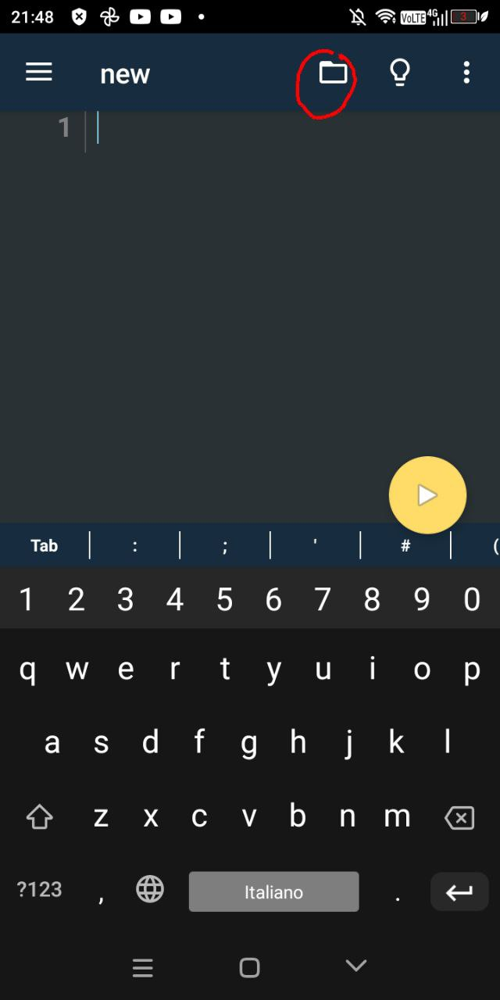
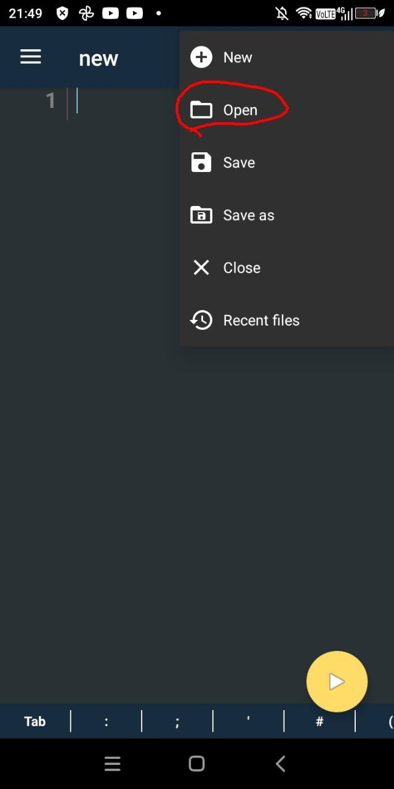
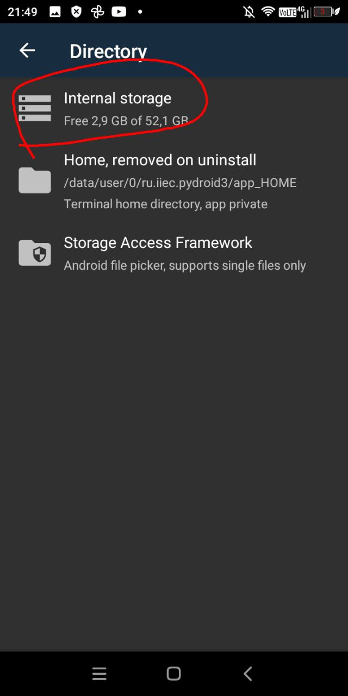
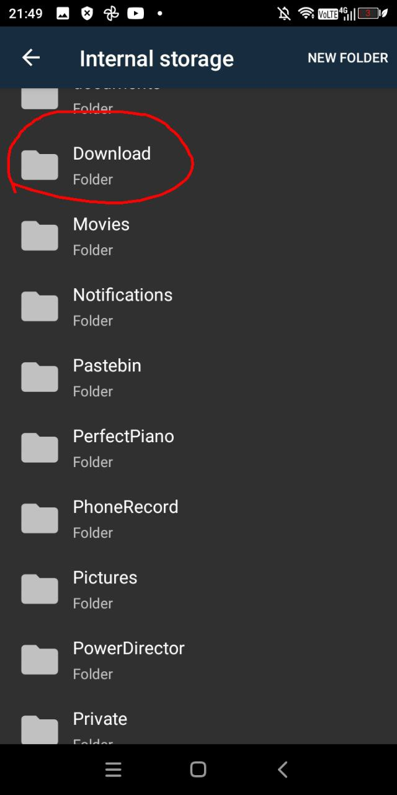

# Pokemon-Black-and-White-2-In-py-No-Gui.

# HOW TO RUN?!
```
pokemonIv
```
now is open cmd and select position file .py and run 

# PreRequirements 
INSTALL: python 3.10.5 install numpy install pygame 

# Conclusion 
this happy game and game you happy this game ricreated in py :)

# can it be used on mobile?
Absolutely! you can use by installing pydroid 3 go to terminal and pip install numpy and then install the project on mobile do these procedures!
# Cliccate sul folder



# clicca open



# Andate su internal Storage 



# trovate Download e cercate Skullthd e il progetto scaricato ora vi apre un folder e aprite solo file .py
 


